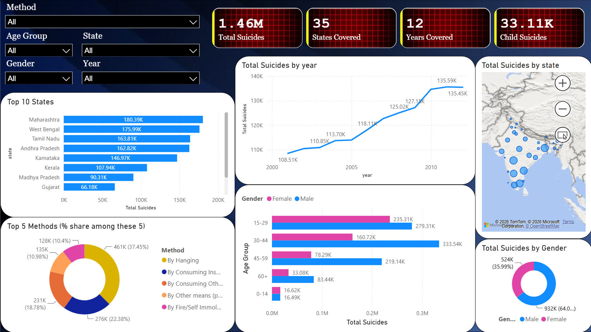
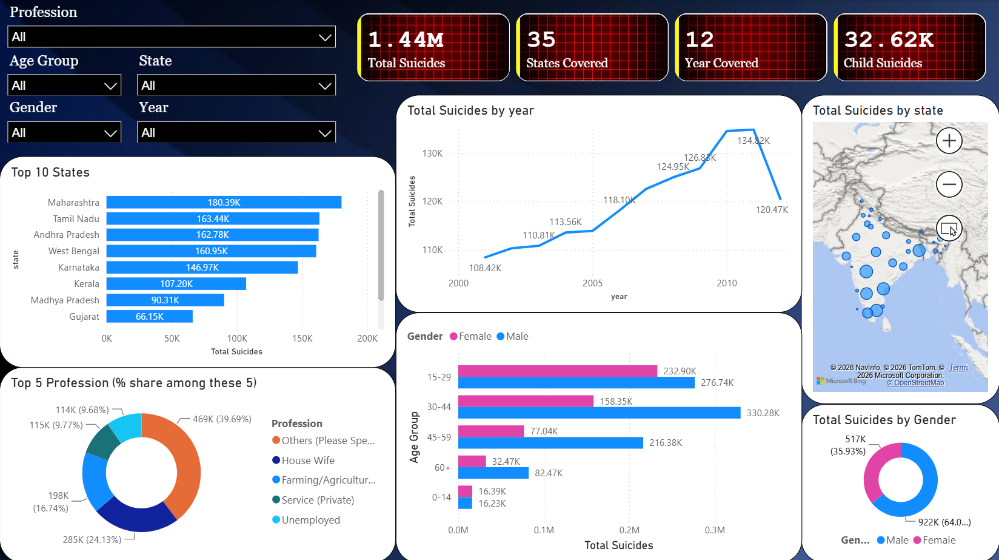

# Suicides in India Analysis (2001–2012)

Data analysis of suicide trends across Indian states (2001–2012) using NCRB data — Python, SQL & Power BI dashboard to explore demographic patterns and causes for public health insights.

---

## Table of Contents
- [Overview](#overview)
- [Objective](#objective)
- [Tools Used](#tools-used)
- [Repository Structure](#repository-structure)
- [Data Source](#data-source)
- [Data Understanding](#data-understanding)
- [A Critical Note on `Type_code`](#a-critical-note-on-type_code)
- [Data Importing (SQL)](#data-importing-sql)
- [Data Cleaning](#data-cleaning)
- [Analysis Notebooks](#analysis-notebooks)
- [Dashboard](#dashboard)
- [Key Findings](#key-findings)
- [Limitations](#limitations)
- [How to Reproduce](#how-to-reproduce)
- [License](#license)
- [Author](#author)

---

## Overview
This project analyzes over a decade of suicide data reported by India's National Crime Records Bureau (NCRB), covering **2001–2012** across **35 states and union territories**. It walks through the full analytics workflow: importing raw data into PostgreSQL, cleaning it, exploring it with Python, and presenting findings through an interactive Power BI dashboard.

## Objective
**Which states, demographics, and social factors show the highest suicide burden in India — and what patterns emerge across causes, methods, and professional background that could inform public health intervention?**

## Tools Used
`Python (Pandas, Matplotlib, Seaborn)` &nbsp;`PostgreSQL` &nbsp;`SQL (window functions, CTEs, conditional aggregation)` &nbsp;`Power BI`


---

## Data Source
- Original dataset: [Suicides in India (2001–2012) — NCRB via Kaggle](https://www.kaggle.com/datasets/rajanand/suicides-in-india)
- [Raw CSV](Data/Orignal_Data/Suicides_in_India_2001_2012.csv)
- [Cleaned CSV](Data/cleaned_data/suicides_in_india_cleaned_data.csv)

---

## Data Understanding

| Column | Description |
|---|---|
| `State` | Name of the Indian state/UT |
| `Year` | Year of record, 2001–2012 |
| `Type_code` | Which of 5 independent classification lenses this row belongs to (see below) |
| `Type` | The specific category within that lens (e.g. "Family Problems", "Hanging", "Farming") |
| `Gender` | Male / Female |
| `Age_group` | 0-14, 15-29, 30-44, 45-59, 60+ (plus an aggregate `0-100+` bucket) |
| `Total` | Number of suicides recorded for that specific combination |

### The 5 `Type_code` categories
- **Causes** → *why* the suicide occurred (Family Problems, Bankruptcy, Divorce, Illness, Love Affairs, Failure in Exam, etc.)
- **Means_adopted** → *how* the suicide was carried out (Poisoning, Hanging, Drowning, Firearms, Self Immolation, etc.)
- **Education_Status** → education level (Illiterate, Primary, Matriculate, Graduate, etc.)
- **Professional_Profile** → occupation (Farming, Student, Housewife, Unemployed, Service Govt/Private, etc.)
- **Social_Status** → marital status (Married, Widowed, Divorced, Never Married)

---

## A Critical Note on `Type_code`
Each `Type_code` is a **complete, independent view of the same underlying suicides** — not a separate, additive subset. Summing `Total` across multiple `Type_code`s inflates the count, because the same case gets counted once under each lens it appears in.

**Proof, from this dataset:** for a fixed group (Maharashtra, 2010, Male, 30–44), the `Total` sums under `Causes`, `Means_adopted`, and `Professional_Profile` are all **identical** — because all three are re-describing the same set of cases through a different lens, not counting different people. At the national level, the three totals land within ~1% of each other (~1.44M–1.46M), confirming the same pattern.

**Practical implication:** every notebook and every dashboard tab in this project filters to **one `Type_code` at a time** before aggregating. `Education_Status` and `Social_Status` are additionally excluded from age-based analysis, since they are only ever reported at an aggregate `0-100+` age level in the source data — never broken into the 5 real age brackets.

---

## Data Importing (SQL)
```sql
-- Creating Table
CREATE TABLE suicides_in_india(
    State VARCHAR(50) NOT NULL,
    Year INT NOT NULL,
    Type_code VARCHAR(70),
    Type VARCHAR(150),
    Gender VARCHAR(20),
    Age_group VARCHAR(20),
    Total INT
);

-- Importing data
COPY suicides_in_india (State, Year, Type_code, Type, Gender, Age_group, Total)
FROM 'path/to/Suicides_in_India_2001_2012.csv'
DELIMITER ','
CSV HEADER;
```
> **Note:** if re-running this import, `TRUNCATE TABLE suicides_in_india;` first to avoid accidentally duplicating rows on a second run.

---

## Data Cleaning
No null or missing values exist in this dataset. Cleaning instead focused on removing rows that would distort analysis:

1. **`Total = 0`** rows removed — no suicide cases to analyze
2. **`Age_group = '0-100+'`** rows removed — an aggregate across the 5 real age groups; keeping it alongside the individual age groups would double-count
3. **`State` containing "Total"** rows removed — pre-aggregated national/state totals (e.g. "Total (All India)"), would double-count

```sql
COPY (
    SELECT *
    FROM suicides_in_india
    WHERE suicides_in_india.total <> 0
        AND suicides_in_india.state NOT ILIKE '%total%'
        AND suicides_in_india.age_group NOT ILIKE '0-100+'
)
TO 'path/to/suicides_in_india_cleaned_data.csv'
WITH (FORMAT csv, HEADER true);
```

| | Row count |
|---|---|
| Raw dataset | 237,519 |
| After cleaning | 92,159 |

---

## Analysis Notebooks
All notebooks live in [`Python Notebooks/`](Python%20Notebooks/).

| Notebook | Focus | Key questions answered |
|---|---|---|
| `suicides_in_india_exploratory_analysis.ipynb` | National overview | Total suicides, year-wise trend, overall gender/age split, dataset shape checks |
| `suicides_in_india_state_trend_analysis.ipynb` | State & time trends | Highest/lowest states, fastest-growing state, states with declining trends, state-wise averages |
| `suicides_in_india_demographic_analysis.ipynb` | Demographics | Most-affected age group, gender, professional profile, and their combinations |
| `suicides_in_india_causes_analysis.ipynb` | Causes & methods | Main cause and main method nationally and by state/age/gender |

Each notebook filters to one `Type_code` at a time — see [A Critical Note on `Type_code`](#a-critical-note-on-type_code).

---

## Dashboard
Location: [`Power BI Dashboards/`](Power%20BI%20Dashboards/)

An interactive Power BI dashboard with **three tabs** — **Causes**, **Profession**, and **Method** — each filterable by Age Group, State, Gender, and Year.

> **Why the totals differ slightly by tab:** Causes (~1.44M), Profession (~1.44M), and Method (~1.46M) are independently reported categories in the source data, not subsets of one master total — see the `Type_code` note above.





The interactive `.pbix` file is available in [`Power BI Dashboards/`](Power%20BI%20Dashboards/) — open with the free Power BI Desktop app.

---

## Key Findings
- Suicides in India rose from **108.5K (2001)** to a peak of **135.6K (2011)** — roughly a 25% increase over the decade — before dropping to **120.5K in 2012**.
- **Maharashtra**, **Tamil Nadu**, and **West Bengal** consistently report the highest totals among all states/UTs.
- The **15–29** and **30–44** age groups account for the largest share of cases nationally.
- Male suicides outnumber female suicides roughly **64% to 36%** overall.
- **Family Problems** and **Insanity/Mental Illness** are the two leading reported causes, together making up over half of the top-5 causes.
- **Poisoning** and **Hanging** are the most common means adopted nationally.
- **West Bengal**, **Andhra Pradesh**, **Karnataka**, **Tamil Nadu**, and **Madhya Pradesh** are the top five states with the highest number of child suicides.
- **Kerala** has shown a continuously declining trend over the past 12 years, with the lowest growth rate at approximately **-1.0%**.
- **Jharkhand** has recorded the fastest growth rate at **427.60%**.
---

## Limitations
- NCRB-reported suicide statistics are known to undercount actual cases due to social stigma, underreporting, and inconsistent classification across states. Findings should be read as directional trends in *reported* data, not absolute figures.
- `Education_Status` and `Social_Status` are excluded from age-group-based analysis, as they are only reported at an aggregate `0-100+` level in the source data.
- `Causes`, `Means_adopted`, and `Professional_Profile` **cannot be cross-tabulated against each other** (e.g. "main cause by profession") — the dataset reports them as independent aggregate breakdowns, not joint, case-level records.

---

## How to Reproduce
1. Clone this repository
2. Load [`Suicides_in_India_2001_2012.csv`](Data/Original_Data/) into PostgreSQL using the scripts in [`SQL/`](SQL/)
3. Run the cleaning query to generate the cleaned CSV
4. Open the notebooks in [`Python Notebooks/`](Python%20Notebooks/) in order (Exploratory → State Trend → Demographic → Causes)
5. Open the `.pbix` file in [`Power BI Dashboards/`](Power%20BI%20Dashboards/) with Power BI Desktop (free) to explore the dashboard interactively

---

## License
This project's code is licensed under the [MIT License](LICENSE). Use of the underlying dataset is subject to its original source's terms (NCRB / Kaggle).

